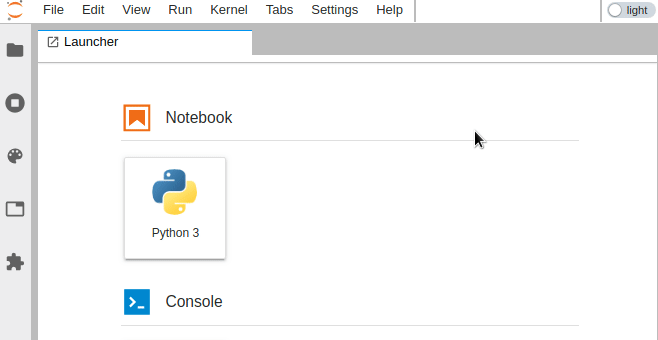

# jupyterlab-theme-toggle


[](https://mybinder.org/v2/gh/jtpio/jupyterlab-theme-toggle/stable?urlpath=lab)
[](https://www.npmjs.com/package/jupyterlab-theme-toggle)

JupyterLab extension to toggle the theme in the Top Bar area.



This extension was originally developed as part of the [jupyterlab-topbar](https://github.com/jtpio/jupyterlab-topbar) project, and extracted into its own repository later on.

## Prerequisites

* JupyterLab 1.0+

## Installation

This extension requires the `jupyterlab-topbar-extension` extension for JupyterLab to display the visual switch:

```bash
jupyter labextension install jupyterlab-topbar-extension jupyterlab-theme-toggle
```

To only install the keyboard shortcut (`Cmd/Ctrl+y` by default):

```bash
jupyter labextension install jupyterlab-theme-toggle
```


## Development

```bash
# create a new conda environment
conda create -n jupyterlab-theme-toggle jupyterlab nodejs
conda activate jupyterlab-theme-toggle

# required to place indicators in the top area
jupyter labextension install jupyterlab-topbar-extension

# install dependencies
jlpm

# local install of the extension
jupyter labextension install .
```

To rebuild the package and the JupyterLab app:

```bash
jlpm run build
jupyter lab build
```

